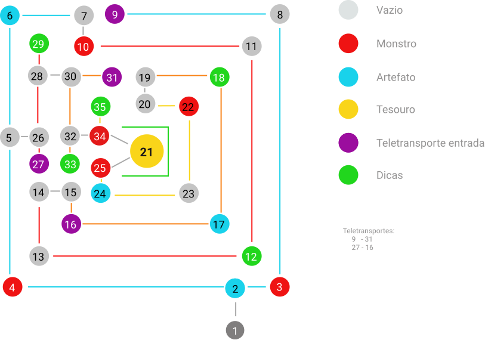

# Equipe3-Labyrinth_Masters

Trabalho da disciplina de MATA77-Programacão Funcional, referente ao game: Colossal Cave.

## Membros:

- Lucas Natanael Brito Prates;
- Arthur Gonçalves de Lima;
- Otávio Augusto Cartaxo Araújo;
- Jônatas da Silva Santos

## Primeiro entregavel

Para o primeiro entregável foram criados o esboço do mapa. E a estrutura inicial para o jogo.

###  Verbos

| **Verb**    | **Description**                                           |
| :---------: | :-------------------------------------------------------: |
| **Norte**   | Move o personagem para o norte do labirinto               |
| **Sul**     | Move o personagem para o Sul do labirinto                 |
| **Leste**   | Move o personagem para o Leste do labirinto               |
| **Oeste**   | Move o personagem para o Oeste do labirinto               |

### Mapa

